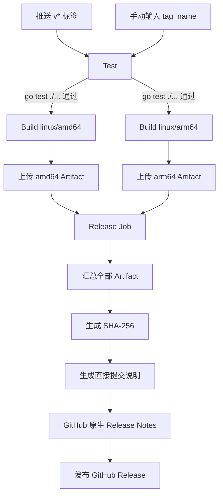

# GitHub Actions CI/CD 标准

状态：正式规范  
适用范围：使用 GitHub Releases 分发 Linux 单文件程序的项目  
参考实现：ServerTool  
配套文档：[Linux CLI 安装与自更新标准](INSTALL_UPDATE_STANDARD.md)

## 1. 目标

本标准将代码检查、跨架构构建、完整性校验和 GitHub Release 发布组成一条可重复、可审计的流水线。

流水线必须保证：

- 测试不通过不得构建。
- 任一目标架构构建不通过不得发布。
- 正式版本号只来自 Git 标签或手动发布输入。
- 版本号必须同时注入程序、二进制文件名和校验文件名。
- Release 必须包含全部目标架构二进制和 SHA-256 校验文件。
- 发布说明同时覆盖直接提交和 Pull Request。
- 普通任务保持只读权限，仅发布任务取得 `contents: write`。
- 任一阶段失败时停止后续阶段，不创建不完整 Release。

## 2. CI 与 CD 的边界

| 阶段 | 职责 | 是否修改 GitHub Release |
| --- | --- | --- |
| CI / Test | 编译前质量检查、单元测试、静态检查 | 否 |
| CI / Build | 按平台和架构构建、注入版本、上传临时 Artifact | 否 |
| CD / Release | 汇总产物、生成校验和说明、创建 Release | 是 |

GitHub Actions Artifact 是流水线内部的临时传递文件；GitHub Release Asset 才是最终提供给用户下载的正式文件，两者不得混淆。

## 3. 当前流水线总览



Job 依赖关系：

```text
test
  └── build (amd64、arm64 并行)
        └── release
```

## 4. 触发方式

### 4.1 标签自动发布

推送任何以 `v` 开头的标签时触发：

```yaml
on:
  push:
    tags:
      - 'v*'
```

标准发布命令：

```bash
git tag v1.2.0
git push origin v1.2.0
```

此时版本来源为：

```yaml
github.ref_name
```

### 4.2 手动发布

GitHub Actions 页面支持 `workflow_dispatch`，必须填写 `tag_name`：

```yaml
workflow_dispatch:
  inputs:
    tag_name:
      required: true
      type: string
```

手动发布时，目标提交是运行工作流时选择分支的 `${{ github.sha }}`，发布 Action 使用输入的 `tag_name` 创建或更新对应 Release。

### 4.3 统一版本表达式

自动和手动发布统一使用：

```yaml
${{ inputs.tag_name || github.ref_name }}
```

所有 Job 必须使用同一版本表达式，禁止分别推导版本，以免程序内版本、Artifact 和 Release 名称不一致。

## 5. 并发控制

```yaml
concurrency:
  group: release-${{ github.ref }}
  cancel-in-progress: false
```

含义：

- 同一个 Git 引用的发布进入同一并发组。
- 已开始的发布不会被后来任务取消。
- 避免同一标签的多个任务同时上传和覆盖 Release 资产。

正式发布不得设置 `cancel-in-progress: true`，否则可能在上传到一半时终止。

## 6. 权限模型

工作流顶层只授予读取权限：

```yaml
permissions:
  contents: read
```

只有 Release Job 提升权限：

```yaml
release:
  permissions:
    contents: write
```

原则：

- Test 和 Build 不需要写仓库或 Release。
- Release 需要创建标签、Release 和上传资产，因此使用 `contents: write`。
- 不得在整个工作流顶层授予写权限。
- 不得把长期 Personal Access Token 写入代码或日志；同仓库发布优先使用 GitHub 自动提供的 token。

## 7. Test Job

### 7.1 当前质量门禁

```yaml
- uses: actions/checkout@v7

- uses: actions/setup-go@v7
  with:
    go-version-file: go.mod
    cache: true

- run: go test ./...
```

关键要求：

- Go 版本必须读取 `go.mod`，避免工作流和项目版本漂移。
- 启用 Go 缓存以缩短重复构建时间。
- 测试失败后 Build Job 不得执行。

### 7.2 推荐增强门禁

所有项目建议至少运行：

```bash
go test ./...
go vet ./...
```

高要求项目可增加：

```bash
go test -race ./...
staticcheck ./...
govulncheck ./...
```

`-race` 只需要在一个原生平台运行，不需要在每个交叉构建架构重复执行。

### 7.3 日常 CI 建议

当前 ServerTool 的 Release 工作流只在发布时运行测试。所有项目建议额外建立 `.github/workflows/ci.yml`，在日常推送和 PR 时提前发现问题：

```yaml
name: ci

on:
  push:
    branches: [main]
  pull_request:

permissions:
  contents: read

jobs:
  test:
    runs-on: ubuntu-latest
    steps:
      - uses: actions/checkout@v7
      - uses: actions/setup-go@v7
        with:
          go-version-file: go.mod
          cache: true
      - run: go test ./...
      - run: go vet ./...
```

日常 CI 不能替代正式发布前的 Test Job；Release 工作流仍应独立验证一次。

## 8. Build Job

### 8.1 依赖 Test

```yaml
needs: test
```

只有测试成功才允许构建正式二进制。

### 8.2 构建矩阵

```yaml
strategy:
  fail-fast: false
  matrix:
    include:
      - goos: linux
        goarch: amd64
        artifact: snailtool_linux_amd64
      - goos: linux
        goarch: arm64
        artifact: snailtool_linux_arm64
```

`fail-fast: false` 允许某个架构失败后，其他架构继续完成并提供诊断结果。但由于 Release Job 依赖整个 Build Job，任一矩阵项失败都不会发布。

### 8.3 可复现构建参数

```yaml
env:
  CGO_ENABLED: 0
  GOOS: ${{ matrix.goos }}
  GOARCH: ${{ matrix.goarch }}
```

```bash
go build -trimpath -ldflags="${LDFLAGS}" ...
```

作用：

- `CGO_ENABLED=0`：生成不依赖系统 C 运行库的静态 Go 程序。
- `GOOS/GOARCH`：明确目标平台和架构。
- `-trimpath`：移除构建机本地路径。
- `-s -w`：移除调试符号，减小体积。

### 8.4 版本字符校验

版本写入文件名之前必须限制为：

```text
A-Z a-z 0-9 . _ -
```

Shell 校验示例：

```bash
case "$VERSION" in
  *[!A-Za-z0-9._-]*) exit 1 ;;
esac
```

这可以避免路径分隔符、空格或控制字符污染构建路径和发布资产。

### 8.5 构建信息注入

```bash
VERSION="${RELEASE_TAG}"
COMMIT="${GITHUB_SHA}"
BUILD_DATE="$(date -u +%Y-%m-%dT%H:%M:%SZ)"
LDFLAGS="-s -w \
  -X <MODULE>/internal/version.Version=${VERSION} \
  -X <MODULE>/internal/version.Commit=${COMMIT} \
  -X <MODULE>/internal/version.BuildDate=${BUILD_DATE}"
```

程序运行：

```bash
command --version
```

必须能够显示上述信息。

### 8.6 正式产物命名

```text
<PRODUCT>_<OS>_<ARCH>_<VERSION>
```

ServerTool 示例：

```text
snailtool_linux_amd64_v1.2.0
snailtool_linux_arm64_v1.2.0
```

### 8.7 上传流水线 Artifact

```yaml
- uses: actions/upload-artifact@v7
  with:
    name: ${{ matrix.artifact }}_${{ env.RELEASE_VERSION }}
    path: dist/${{ matrix.artifact }}_${{ env.RELEASE_VERSION }}
    if-no-files-found: error
```

必须使用 `if-no-files-found: error`，禁止在产物缺失时继续发布。

## 9. Release Job

### 9.1 依赖全部构建完成

```yaml
needs: build
```

任一架构构建失败时，Release Job 自动跳过。

### 9.2 获取完整 Git 历史

```yaml
- uses: actions/checkout@v7
  with:
    fetch-depth: 0
```

生成相邻版本提交记录需要完整标签和历史，因此不得使用默认浅克隆。

### 9.3 汇总矩阵产物

```yaml
- uses: actions/download-artifact@v8
  with:
    path: release-assets
    merge-multiple: true
```

所有架构文件统一进入 `release-assets/`，后续校验和发布只操作该目录。

### 9.4 生成校验文件

```bash
sha256sum <PRODUCT>_* > checksums.txt
```

结果示例：

```text
snailtool_linux_amd64_v1.2.0
snailtool_linux_arm64_v1.2.0
checksums.txt
```

校验文件是安装和更新的完整性依据，生成失败必须停止发布。

### 9.5 生成 Release Notes

ServerTool 使用两层说明：

1. `scripts/generate_release_notes.sh` 使用 `git log` 列出相邻标签间的直接提交。
2. `generate_release_notes: true` 使用 GitHub 原生能力补充已合并 PR、贡献者和完整变更链接。

```yaml
- name: Generate release notes from commits
  run: bash scripts/generate_release_notes.sh "${RUNNER_TEMP}/release-notes.md"

- uses: softprops/action-gh-release@v3
  with:
    body_path: ${{ runner.temp }}/release-notes.md
    generate_release_notes: true
```

这套组合同时适用于个人直接向 `main` 提交和团队 PR 合并。

### 9.6 发布 Release

```yaml
- uses: softprops/action-gh-release@v3
  with:
    tag_name: ${{ env.RELEASE_TAG }}
    name: ${{ env.RELEASE_TAG }}
    target_commitish: ${{ github.sha }}
    body_path: ${{ runner.temp }}/release-notes.md
    generate_release_notes: true
    files: release-assets/*
```

发布结果包括：

- 与版本一致的 GitHub Release 名称。
- 两个 Linux 架构二进制。
- 版本化 SHA-256 校验文件。
- 直接提交列表、PR、贡献者和完整变更链接。

## 10. 完整发布时序

以发布 `v1.2.0` 为例：

1. 维护者完成代码并推送到 `main`。
2. 日常 CI 验证测试和静态检查。
3. 维护者创建并推送 `v1.2.0` 标签。
4. Release 工作流启动。
5. Test Job 执行 `go test ./...`。
6. amd64、arm64 Build Job 并行构建。
7. 构建时注入 `v1.2.0`、提交 SHA 和 UTC 构建时间。
8. 两个二进制作为内部 Artifact 上传。
9. Release Job 下载并合并 Artifact。
10. 生成 `checksums.txt`。
11. 根据上一个标签和 `v1.2.0` 生成提交说明。
12. GitHub 补充原生 Release Notes。
13. 创建 Release 并上传全部文件。
14. 用户通过安装脚本或 `command update` 获取新版本。
15. 安装脚本验证 SHA-256 后原子替换旧程序。

## 11. 失败与恢复策略

| 失败位置 | 流水线结果 | 是否产生 Release |
| --- | --- | --- |
| Test 失败 | Build、Release 跳过 | 否 |
| 单个架构 Build 失败 | Release 跳过 | 否 |
| Artifact 缺失 | 上传步骤失败 | 否 |
| Artifact 下载失败 | Release Job 失败 | 否 |
| SHA-256 生成失败 | Release Job 失败 | 否 |
| Release Notes 生成失败 | Release Job 失败 | 否 |
| GitHub Release API 失败 | 发布失败 | 否或保留原有 Release 状态 |
| 资产上传中断 | Job 失败，应重新运行同一标签任务 | 可能存在未完整 Release，必须检查 |

重新运行规则：

- 代码没有变化时，优先在 GitHub Actions 页面重新运行失败 Job。
- 已存在同标签 Release 时，发布 Action 会更新该 Release 和同名资产。
- 不得为了重试随意创建新的版本标签。
- 如果正式资产已经被用户下载，不建议移动同一标签到不同提交；应发布新的修订版本。

## 12. 发布操作手册

### 12.1 发布前

```bash
git status --short
go test ./...
go vet ./...
```

确认：

- 工作区没有意外修改。
- `main` 已同步远端。
- 版本号高于上一个 Release。
- 安装脚本能够解析新产物命名。

### 12.2 自动标签发布

```bash
git tag v1.2.0
git push origin v1.2.0
```

### 12.3 发布后验收

检查 Release 是否包含：

```text
<PRODUCT>_linux_amd64_v1.2.0
<PRODUCT>_linux_arm64_v1.2.0
checksums.txt
```

验证：

```bash
curl -fsSL <INSTALL_SCRIPT_URL> | sudo sh
<COMMAND> --version
sudo <COMMAND> update
```

期望：

- 首次安装成功。
- `--version` 显示新标签。
- 再次更新提示版本和文件校验均一致，不重复下载二进制。

## 13. 新项目迁移参数

复制本流程时必须替换：

| 项目参数 | ServerTool 示例 |
| --- | --- |
| Go 模块路径 | `snail_tool` |
| 主程序入口 | `./cmd/snail_tool` |
| 版本变量路径 | `snail_tool/internal/version.Version` |
| 产品文件前缀 | `snailtool` |
| 安装命令名 | `snail` |
| Release 架构矩阵 | `linux/amd64`、`linux/arm64` |
| GitHub 仓库 | `Snail-one/ServerTool` |
| 安装脚本路径 | `scripts/install.sh` |
| Release Notes 脚本 | `scripts/generate_release_notes.sh` |

## 14. CI/CD 安全要求

- GitHub Actions 第三方依赖建议固定到完整提交 SHA。
- Dependabot 应持续更新 Actions 依赖。
- 主分支建议启用保护规则和必需状态检查。
- 版本标签建议启用保护规则。
- Release Job 采用最小写权限。
- 禁止在日志输出 token、私钥和完整环境变量。
- 构建产物必须生成 SHA-256；高安全项目还应增加 Cosign、Minisign 或 GPG 签名。
- 发布标签一旦公开使用，不应强制移动或覆盖其指向的提交。
- 正式发布建议使用 GitHub Environment 增加人工审批。

## 15. 验收清单

- [ ] 推送 `v*` 标签可以触发 Release 工作流。
- [ ] 手动输入标签可以触发发布。
- [ ] Test 失败会阻断所有构建和发布。
- [ ] amd64、arm64 可以并行构建。
- [ ] 任一架构失败会阻断 Release。
- [ ] 程序内版本等于 Release 标签。
- [ ] 文件名末尾包含 Release 标签。
- [ ] Artifact 缺失会使工作流失败。
- [ ] Release 包含全部架构产物。
- [ ] 校验文件包含且只包含正式二进制。
- [ ] 安装脚本能够用校验文件验证二进制。
- [ ] 直接提交出现在“本次更新”列表。
- [ ] PR、贡献者和完整变更链接由 GitHub 补充。
- [ ] Test、Build 只有只读权限。
- [ ] 只有 Release Job 拥有 `contents: write`。
- [ ] 同一标签不会并发发布。
- [ ] 发布失败可以安全重新运行。
- [ ] 发布后首次安装、升级、同版本校验和损坏修复均通过。

## 16. ServerTool 参考文件

- 流水线：`.github/workflows/release.yml`
- Release Notes：`scripts/generate_release_notes.sh`
- 本地构建：`scripts/build_linux.sh`、`scripts/build_windows.ps1`
- 安装更新：`scripts/install.sh`
- 程序自更新：`internal/selfupdate/update.go`
- 版本信息：`internal/version/version.go`

其他项目应复用流程、命名和质量门禁，并替换自身模块路径、命令名与仓库地址。
